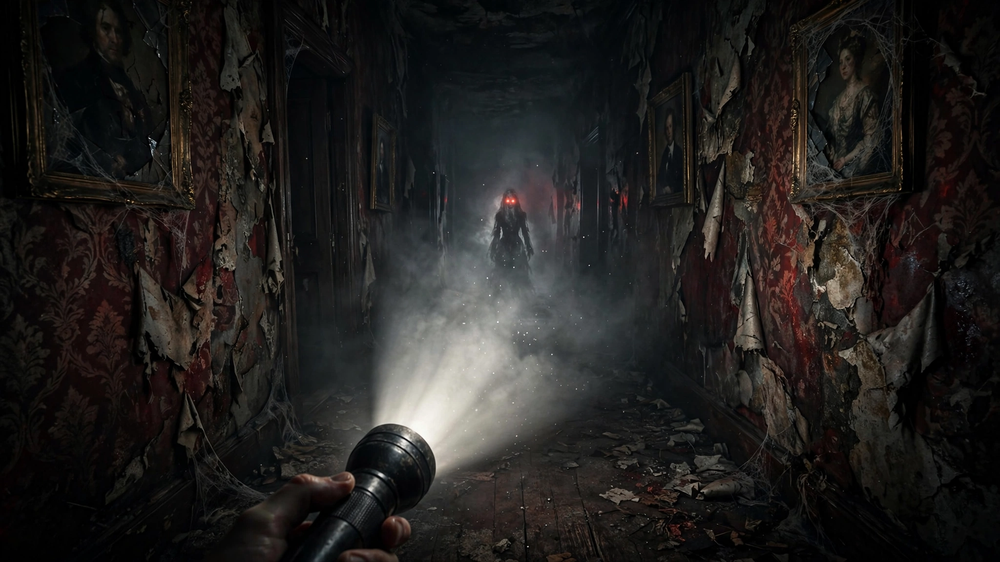

<p align="center">
  
</p>

<p align="center">
  <a href="https://mymyanmarland.github.io/horror-game/">
    
  </a>
</p>

<p align="center">
  
  
  
  
  
</p>

<p align="center">
  
  <br/>
  <em>🔦 ဓာတ်မီးတစ်လက်နဲ့ အမှောင်ထဲကို ဝင်ရဲလား...</em>
</p>


## 📖 ဇာတ်လမ်း | The Story

> ၁၀ ထပ်ရှိတဲ့ ဒီအိမ်ကြီးထဲမှာ **ကျိန်စာသင့်ပစ္စည်းတွေ** ပြန့်ကျဲနေတယ်။
> အခန်းတိုင်းက ပစ္စည်းတွေအားလုံးကို စုပြီး ထွက်ပေါက်ကနေ လွတ်မြောက်ရမယ်။
>
> သတိထား... **အမှောင်ထဲမှာ တစ်ခုခု မင်းကို စောင့်ကြည့်နေတယ်။** 👹
> မီးအလင်းရောင်က မင်းကို မြင်စေသလို — **အဲဒါကိုလည်း မင်းဆီ ဆွဲခေါ်တယ်။**


## ✨ Features

- 🕯️ **First-person 3D corridors** — flashlight lighting, fog, film grain, dust particles
- 👹 **Hunter AI** — သရဲက အလင်း၊ အသံ၊ အနံ့ သုံးမျိုးနဲ့ မင်းကို လိုက်တယ်
- 😮‍💨 **Procedural horror audio** — မောဟိုက်သက်ရှူသံ၊ ခြေသံ၊ နှလုံးခုန်သံ၊ jumpscare scream (WebAudio, no assets)
- 🔋 **Battery / Stamina / Health** survival systems
- 📱 **Mobile ready** — touch joystick + touch controls
- 🗺️ **10 hand-tuned levels** — level တိုင်းမှာ map, enemy, difficulty ပြောင်းတယ်


## 🕹️ Controls

| Action | Desktop | Mobile |
|---|---|---|
| ရွေ့လျားမယ် | `WASD` / မြှားများ | 🕹️ Joystick |
| ပြေးမယ် | `Shift` | 🏃 RUN ခလုတ် |
| မီးဖွင့် / ပိတ် | `F` / Click | 🔦 LIGHT ခလုတ် |
| ခဏရပ် | `Esc` | ⏸ ခလုတ် |
| အသံပိတ် | `M` | — |


## 🗺️ The 10 Levels

| # | အမည် | Name |
|---|---|---|
| 1 | ဝင်ပေါက် | The Entrance |
| 2 | စာကြည့်တိုက် | The Library |
| 3 | ထမင်းစားခန်းမ | The Dining Hall |
| 4 | အိပ်ခန်းများ | The Bedrooms |
| 5 | မြေအောက်ခန်း | The Cellar |
| 6 | စွန့်ပစ်ဆေးရုံ | The Abandoned Ward |
| 7 | ဘုရားခန်း | The Chapel |
| 8 | ဓာတ်ခွဲခန်း | The Laboratory |
| 9 | ထောင် | The Prison |
| 10 | ငရဲခန်း | The Abyss |


## 🛠️ Tech

Single self-contained `index.html` — no build step, no dependencies, no assets.
Canvas-rendered pseudo-3D + WebAudio procedural sound. Deploy anywhere static hosting works.

```
https://mymyanmarland.github.io/horror-game/
```

<p align="center">
  
  <br/>
  <sub>👻 <i>နားကြပ်တပ်ပြီး အမှောင်ခန်းထဲမှာ ဆော့ကြည့်...</i></sub>
</p>
